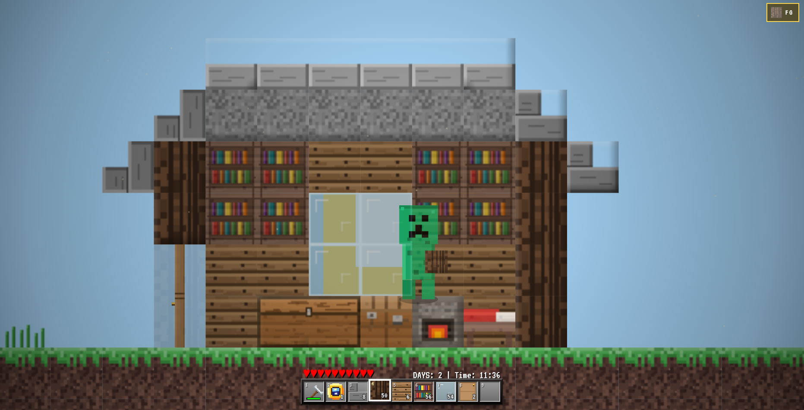

# 🟩 Creep Craft: Reborn

<div align="center">


**A massive browser-based 2D sandbox game with survival elements**

Built with Vanilla JavaScript, HTML5 Canvas, and Web Audio API — No engines, no frameworks, pure web technology.

[🎮 Play Now](#-quick-start) • [📖 Features](#-key-features) • [🎮 Controls](#-controls) • [⌨️ Commands](#️-command-console) • [🤝 Contribute](#-contributing)

</div>

---

## 📖 The Story

You are a **creeper** who has somehow ended up in Steve's world. However, Steve has died, and since he was playing in **hardcore mode**, he will never respawn.

**Your mission?** Finish the game for him and survive.

---

## 🎮 Quick Gameplay Preview

<table>
  <tr>
    <td align="center"><strong>Building & Exploration</strong></td>
    <td align="center"><strong>Underground Mining</strong></td>
    <td align="center"><strong>Cave Adventures</strong></td>
  </tr>
  <tr>
    <td align="center"></td>
    <td align="center"></td>
    <td align="center"></td>
  </tr>
</table>

---

## 🌟 Key Features

### 🗺️ **World & Generation**
- **Procedural World Generation** — Explore a massive world of 20,000 × 256 blocks
- **Diverse Biomes** — Multiple biome types with unique characteristics and generation patterns
- **Cave Systems** — Deep, complex cave networks with realistic geometry
- **Natural Resources** — Water and lava pools, ore deposits (Coal, Iron, Gold, Diamonds)
- **Terrain Variety** — Mountains, valleys, plains, and underground caverns

### ⚙️ **Advanced Game Mechanics**
- **Crafting System** — Full crafting table with recipes and ore smelting
- **Furnace System** — Smelt ores and cook food with fuel management
- **Fluid Physics** — Realistic water and lava with 8 levels of flow
- **Fire Mechanics** — Dynamic fire spreading across flammable blocks
- **Explosions** — TNT and creeper explosions with physics simulation
- **Farming** — Till soil with hoe, plant seeds, grow wheat crops

### 🌍 **Dynamic Environment**
- **Day/Night Cycle** — Smooth transitions with dynamic sky palettes
- **Starry Nights** — Beautiful nighttime atmosphere with constellation rendering
- **Advanced Lighting** — Lightmap system with torch, lava, and furnace glow
- **Particle Effects** — Block breaking chunks, blood effects, sparks, falling leaves, smoke
- **Weather Systems** — Atmospheric effects and environmental interactions

### 🧟 **Entities & AI**

| Entity | Behavior | Special Traits |
|--------|----------|---|
| **Zombies** 🧟 | Pathfinding, jumping, melee combat | Spawn in darkness, hunt at night |
| **Spiders** 🕷️ | Wall climbing, advanced AI | Aggressive, scale vertical surfaces |
| **Cows** 🐄 | Wandering, grazing, fleeing | Drop leather and beef when defeated |
| **Pigs** 🐷 | Passive movement, panic behavior | Drop pork chops, can be bred |
| **Sheep** 🐑 | Group herding, eating grass | Drop wool blocks |

### 🎵 **Custom Audio Engine**
- **Procedural Sound Design** — Generated using Web Audio API oscillators and filters
- **Dynamic Music** — Ambient soundtrack that adapts to gameplay and time of day
- **3D Spatial Audio** — Immersive mob footsteps and eerie cave ambience
- **Sound Effects** — Block breaking, tool usage, mob interactions
- **Audio Synthesis** — Professional-grade sound synthesis without pre-recorded audio

### 🎮 **Rich User Interface**
- **Interactive Inventory** — Drag & Drop support, organized storage slots
- **Chest System** — Single and double chest storage for item management
- **Furnace GUI** — Visual smelting interface with progress tracking
- **Command Encyclopedia** — In-game help system with command reference
- **Achievements System** — Progression tracking and reward system
- **Chat System** — Communication and command execution
- **Debug Screen** — Real-time FPS, coordinates, and performance metrics

---

## 🛠️ Technologies

| Technology | Purpose |
|-----------|---------|
| **JavaScript (ES6+)** | Core game logic, physics engine, AI pathfinding, collision detection |
| **HTML5 Canvas** | High-performance 2D rendering with tile caching optimization |
| **CSS3** | Pixel-art UI styling, responsive menus, HUD, inventory interface |
| **Web Audio API** | Procedural audio synthesis, spatial sound, music generation |

---

## 🚀 Quick Start

### Installation

No installation required! The game runs directly in your browser.

```bash
# 1. Clone the repository
git clone https://github.com/Lesend0/Creep-Craft-Reborn.git

# 2. Navigate to the folder
cd Creep-Craft-Reborn

# 3. Open in your browser
# Simply double-click index.html or open it with your browser
```

**💡 Performance Tip:** For best performance and smooth gameplay, use:
- ✅ **Google Chrome** or **Chromium-based browsers** (Edge, Brave, Opera)
- ✅ **Recommended:** Chrome 90+ for optimal WebGL and Canvas performance
- ⚠️ **Note:** Performance varies based on hardware; disable background apps for best results

---

## 🎮 Controls

### Movement & Actions
| Key | Action |
|-----|--------|
| **W, A, S, D** / **Arrow Keys** | Move around the world |
| **Space** / **W** / **Up Arrow** | Jump and climb |
| **LMB (Left Click)** | Attack mobs / Mine blocks |
| **RMB (Right Click)** | Place blocks / Interact (eat, use buckets, open GUI) |
| **Mouse Wheel / Scroll** | Cycle through hotbar items |

### Interface & Settings
| Key | Action |
|-----|--------|
| **E** | Open/Close Inventory |
| **Q** | Drop item from inventory |
| **1-9** | Quick select hotbar item |
| **T** / **`** / **/** | Open chat and command prompt |
| **F3** | Toggle Debug screen (FPS, coordinates, biome info) |
| **Esc** | Pause game / Open settings menu |
| **↑ ↓ ← →** | Navigate menus and UI |

---

## ⌨️ Command Console

Unlock powerful cheats and control the game with in-game commands:

```
/time day                    → Set time to day (brightness 100%)
/time night                  → Set time to night (darkness mode)
/time [0-24000]              → Set specific time value
/give [item] [count]         → Give yourself items or blocks
/summon [entity]             → Spawn entities: zombie, spider, pig, cow, sheep
/noclip                      → Toggle flight mode (pass through blocks)
/heal                        → Restore full health instantly
/gamemode [survival/creative] → Switch between game modes
/clear                       → Clear inventory
/weather clear/rain/thunder  → Change weather effects
```

**View all commands** in the in-game menu: **Help & Controls → Commands Encyclopedia**

---

## 📊 Project Statistics

```
📝 Code Language Distribution
├─ JavaScript (ES6+): 84.5%  ████████████████████
├─ HTML:             15%     ███
└─ CSS:              0.5%    ▌

📦 Game Content
├─ Block Types: 50+
├─ Crafting Recipes: 100+
├─ Entities: 5+ with unique AI
├─ Biomes: 4+
└─ Features: 50+ major systems
```

---

## 🎓 How to Play

### Getting Started
1. **Spawn in a random location** with basic tools
2. **Gather resources** — Break wood, stone, and ore
3. **Craft items** — Use crafting table for tools and blocks
4. **Build shelter** — Protect yourself from mobs at night
5. **Explore** — Mine caves and discover new biomes
6. **Survive** — Stay alive and complete objectives

### Tips & Tricks
- 🌙 **Night is dangerous** — Hostile mobs spawn in darkness
- 🔨 **Better tools = faster mining** — Upgrade from wood → stone → iron → gold → diamond
- 💡 **Use torches** — Place them to light areas and prevent mob spawning
- 🚪 **Build shelter** — Doors prevent most mobs from entering
- ⛏️ **Mine deep** — Diamonds and valuable ores are found deeper underground
- 🏥 **Food is essential** — Hunt animals or farm crops for sustenance

---

## 🤝 Contributing

We love contributions! Whether it's new blocks, crafting recipes, mob AI improvements, or bug fixes:

### How to Contribute
1. **Fork** the repository
2. **Create** a feature branch (`git checkout -b feature/amazing-feature`)
3. **Make your changes** with clear, descriptive commits
4. **Test thoroughly** — Ensure no regressions
5. **Push** to your branch (`git push origin feature/amazing-feature`)
6. **Open** a Pull Request with detailed description

### Ideas for Contributions
- 🧱 **New block types** and textures
- 👾 **Additional mobs** and advanced AI behaviors
- 🔧 **More crafting recipes** and items
- 🎨 **UI/UX improvements** and visual polish
- 🐛 **Bug fixes** and performance optimizations
- 📚 **Documentation** and tutorials
- 🎵 **Audio effects** and music composition
- ⚙️ **Game balance** improvements

---

## 📝 License

This project is open source and available under the **MIT License**.

See the [LICENSE](LICENSE) file for more details.

---

## 🙏 Credits & Inspiration

- **Inspired by:** Minecraft and the classic Creep Craft Flash game
- **Built with:** Vanilla JavaScript — Zero frameworks, pure web technology
- **Special Thanks:**
  - Claude AI for code assistance
  - Web Audio API for sound synthesis capabilities
  - Canvas API for rendering engine
  - JavaScript community for best practices

---

## 📞 Support & Feedback

- Found a bug? Open an [Issue](https://github.com/Lesend0/Creep-Craft-Reborn/issues)
- Have a feature idea? Share it in [Discussions](https://github.com/Lesend0/Creep-Craft-Reborn/discussions)
- Want to improve something? Submit a [Pull Request](https://github.com/Lesend0/Creep-Craft-Reborn/pulls)

---

<div align="center">

### 🌟 Enjoying this project? Please consider giving it a star! ⭐

Your support helps motivate continued development and improvements!

**[⬆ Back to Top](#-creep-craft-reborn)**

Made with ❤️ by [Lesend0](https://github.com/Lesend0)

</div>
